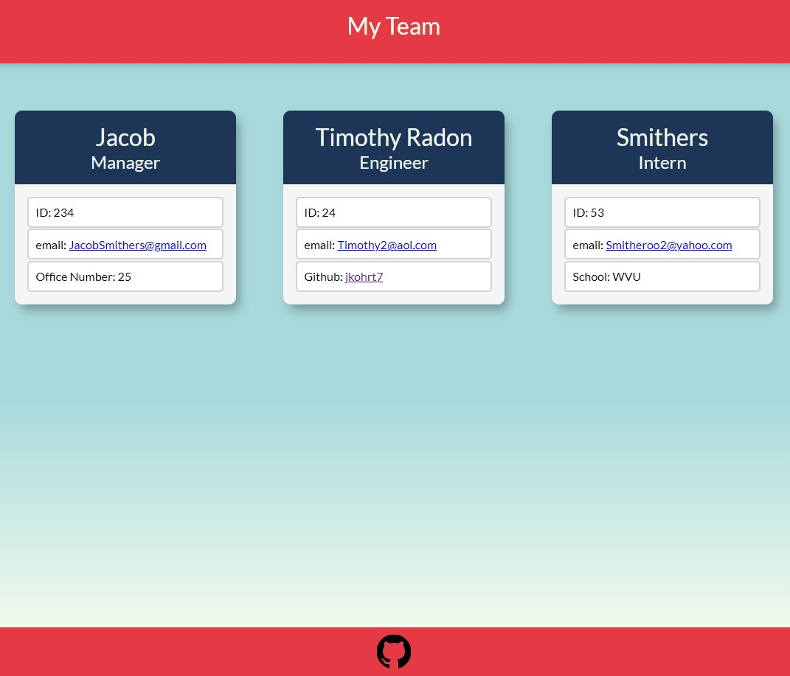

# Employee Directory Generator
[](https://opensource.org/licenses/MIT)

## Description
A small node.js project that asks users to enter information about employees in the command line and then
generates an index.html page displaying all of the entered info.

## Contents
- [Installation](#installation)
- [Usage](#usage)
- [Credits](#credits)
- [Questions](#questions)
- [License](#license)

## Installation
This project requires node.js to run. You can get it [here](https://nodejs.org/en/) if you don't have it installed.

To install the project itself, open the root folder in a command line interface and then execute the command ```npm install``` to load all the required dependencies. 

You can then run the program with ```npm start```.

## Usage
- Start the program with ```npm start```.
- The program will always ask you to input information about your team's manager: name, ID, email, and office number.
- You will then be given the option to add information about as many Engineers or Interns as you want.
- When you are finished adding employees, select 'No' when prompted with 'Would you like to add another employee?'. An index.html file will then be generated and placed in the ~/dist folder of the project, along with a placeholder stylesheet. An example of the output is shown below:


You can also watch a video demonstration [here](https://youtu.be/fLIJ2ojP8tc);

## Questions
If you have any questions about using or contibuting to the project, you can contact me via email or though github:
- Email: jkohrt7@gmail.com
- Github: [@jkohrt7](https://github.com/jkohrt7)

## Credits
- [Inquirer ](https://www.npmjs.com/package/inquirer) 
- [Jared Kohrt ](https://github.com/jkohrt7/) 

## License
[MIT](https://opensource.org/licenses/MIT)
